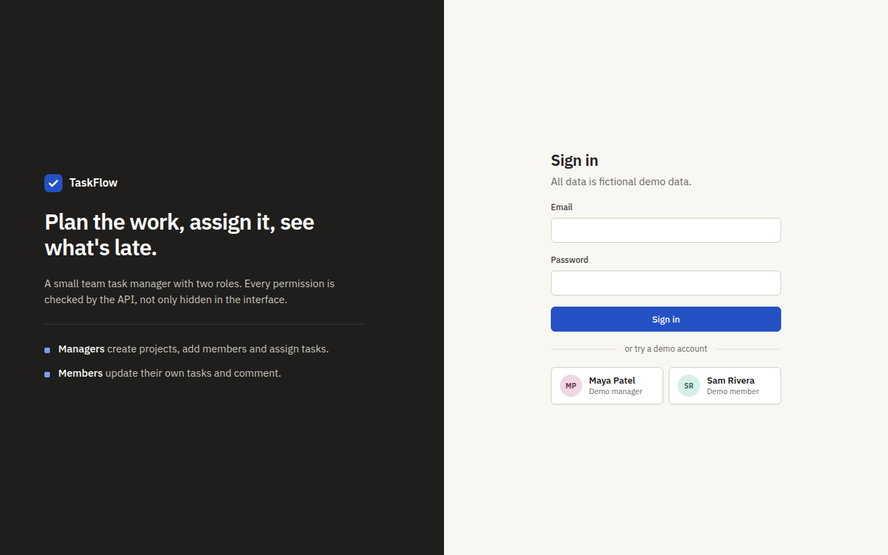
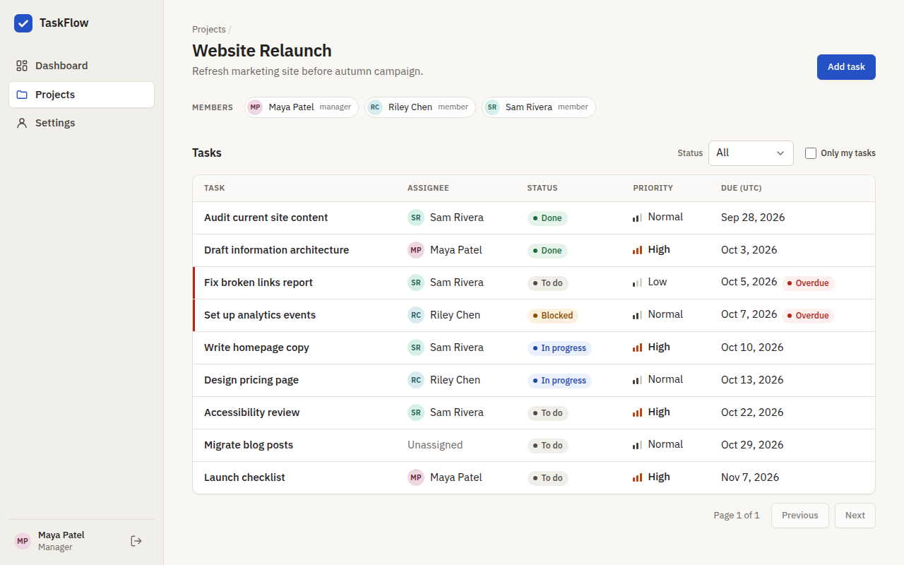
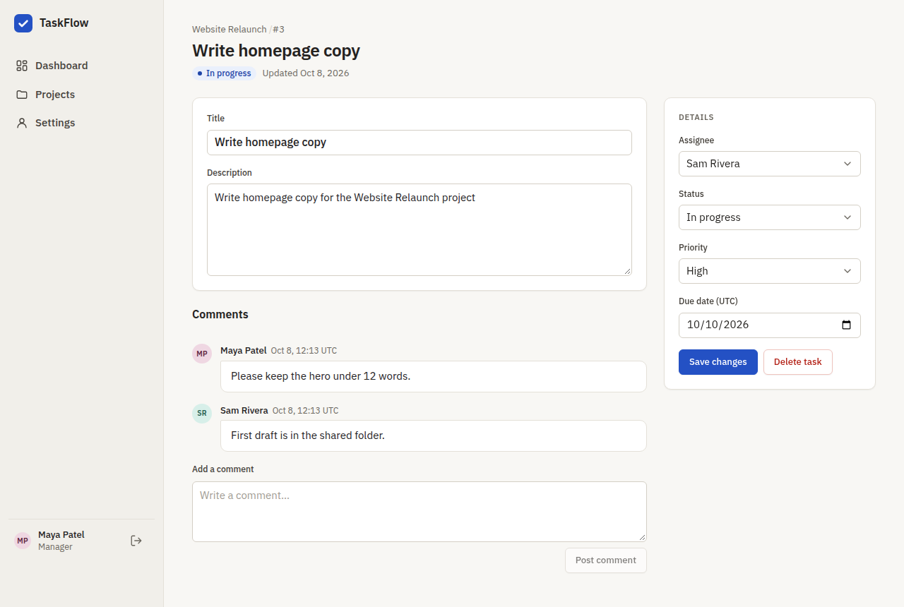
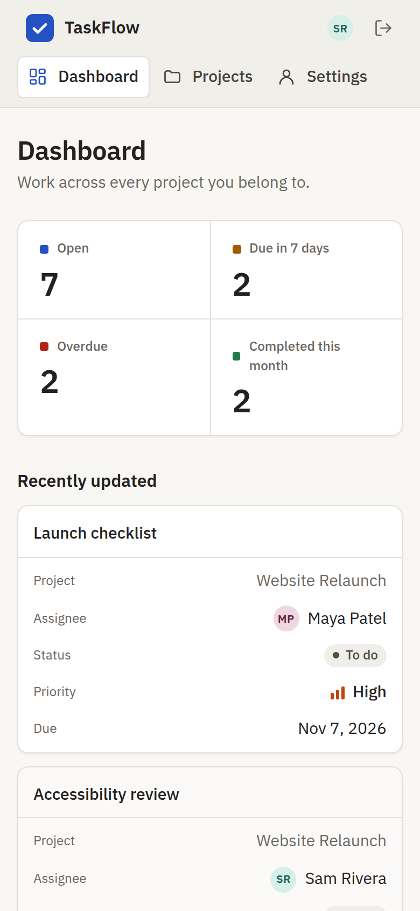

# TaskFlow

A role-aware team task manager demo built with Angular, ASP.NET Core and PostgreSQL.
Managers plan projects and assign work; members update their own tasks and comment — and every permission is enforced by the API, not just hidden in the UI.


## Demo

| Account | Email | Password |
| --- | --- | --- |
| Manager | `maya@taskflow.demo` | `Demo123!` |
| Member | `sam@taskflow.demo` | `Demo123!` |

The sign-in page has one-click buttons for both. All data is fictional seed data.



## Features and roles

| | Manager | Member |
| --- | --- | --- |
| See projects they belong to, dashboard, comments | ✓ | ✓ |
| Create projects, add members | ✓ | ✓ (becomes manager of a project they create) |
| Create, edit, assign, delete tasks | ✓ | — |
| Change status of a task | any task | only tasks assigned to them |

- Dashboard: open / due in 7 days / overdue / completed this month; each card filters the list.
- Project view: member chips, status and "only my tasks" filters, pagination, sorted by due date then priority.
- Task view: field-level editing by role, comment timeline, delete with confirmation. Fields you can't edit read as plain text, with a note explaining why.
- Mobile: the sidebar becomes a top bar and the task table becomes stacked cards. Overdue is shown as text, not color alone.
- Interface: a restrained B2B look built with plain CSS and design tokens (`client/src/styles.css`), with no UI library. Status labels pair a color with text, priority shows as bars plus a word, and people get initials avatars.

<p>
  
  
</p>
<p></p>

## Architecture

```text
Browser (Angular 22)  ──/api + HttpOnly session cookie──▶  ASP.NET Core 10 minimal API
                                                            │ validation, ProblemDetails errors
                                                            │ Rules.cs: permission checks on every request
                                                            ▼
                                                 EF Core 10 + Npgsql ──▶ PostgreSQL 16
```

More detail: [docs/architecture.md](docs/architecture.md) · spec and acceptance scenarios: [docs/spec.md](docs/spec.md)

## Run locally

Prerequisites: Docker, .NET 10 SDK, Node 22 (`nvm use` reads `.nvmrc`).

```bash
cp .env.example .env
docker compose up -d db                  # PostgreSQL on localhost:5432

cd server/TaskFlow.Api && dotnet run     # API on http://localhost:5000 (migrates + seeds on start)

cd client && npm ci && npx ng serve      # UI on http://localhost:4200 (proxies /api to :5000)
```

Reset the demo data: `docker compose down -v && docker compose up -d db`, then restart the API.

Public demo mode: set `DEMO_RESET_MINUTES=60` in `.env` (or `Demo__ResetMinutes=60` on your host). Every 60 minutes
the API wipes projects, tasks and comments and re-seeds them; demo users stay signed in. A banner shows the next reset.

Everything in one container: `docker compose --profile full up --build`, then open http://localhost:8080.

## Tests

```bash
dotnet test server               # needs the db container running; uses a separate taskflow_test database
cd client && npx ng test         # Angular unit tests (Vitest)
```

API: 6 unit tests for the role rules and 13 integration tests that go through HTTP, auth and EF Core
into a real PostgreSQL database: manager can assign, member gets 403 when reassigning,
non-member gets 404, invalid status gets 400, status persists, dashboard counts match the seed,
sessions survive an API restart, and the demo reset restores the seed without signing anyone out.

Client: 22 unit tests for the auth guard and 401 handling, the login page, the task table
(overdue shown as text) and the error/date helpers.

GitHub Actions runs both on every push (`.github/workflows/ci.yml`).

## Trade-offs and next steps

- **Cookie session, not a token in localStorage.** HttpOnly + SameSite=Strict, so scripts can't read it and other sites can't use it. Requires UI and API on the same site — in production the API serves the built Angular app.
- **404 for non-members** instead of 403, so project ids can't be probed.
- **UTC everywhere.** Stored and displayed in UTC; a due date means the end of that day UTC.
- **PATCH can't clear fields:** null means "unchanged", so an assignee or due date can't be removed once set.
- **"Completed this month" uses `updated_at`** because the schema has no `completed_at`.
- **Session keys in Postgres.** The cookie-encryption keys are stored in the database so restarts and redeploys keep users signed in. They're stored unencrypted; protecting them with a certificate is the next step if the database isn't trusted.
- **Periodic reset over read-only mode** for the public demo: visitors can try every feature, and vandalism lasts at most one interval.
- Next: end-to-end browser tests in CI, a `completed_at` column, and explicit "clear" for assignee and due date.
