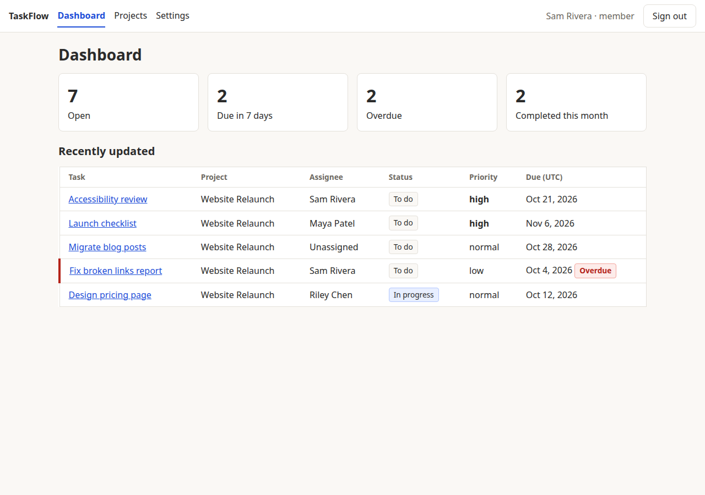

# TaskFlow

A role-aware team task manager demo built with Angular, ASP.NET Core and PostgreSQL.
Managers plan projects and assign work; members update their own tasks and comment — and every permission is enforced by the API, not just hidden in the UI.



## Demo

| Account | Email | Password |
| --- | --- | --- |
| Manager | `maya@taskflow.demo` | `Demo123!` |
| Member | `sam@taskflow.demo` | `Demo123!` |

The sign-in page has one-click buttons for both. All data is fictional seed data.

## Features and roles

| | Manager | Member |
| --- | --- | --- |
| See projects they belong to, dashboard, comments | ✓ | ✓ |
| Create projects, add members | ✓ | ✓ (becomes manager of a project they create) |
| Create, edit, assign, delete tasks | ✓ | — |
| Change status of a task | any task | only tasks assigned to them |

- Dashboard: open / due in 7 days / overdue / completed this month; each card filters the list.
- Project view: member chips, status and "only my tasks" filters, pagination, sorted by due date then priority.
- Task view: field-level editing by role, comment timeline, delete with confirmation.
- Mobile: the task table becomes stacked cards. Overdue is shown as text, not color alone.

## Architecture

```text
Browser (Angular 22)  ──/api + HttpOnly session cookie──▶  ASP.NET Core 10 minimal API
                                                            │ validation, ProblemDetails errors
                                                            │ Rules.cs: permission checks on every request
                                                            ▼
                                                 EF Core 10 + Npgsql ──▶ PostgreSQL 16
```

More detail: [docs/architecture.md](docs/architecture.md) · spec and acceptance scenarios: [docs/spec.md](docs/spec.md)

## Run locally

Prerequisites: Docker, .NET 10 SDK, Node 22 (`nvm use` reads `.nvmrc`).

```bash
cp .env.example .env
docker compose up -d db                  # PostgreSQL on localhost:5432

cd server/TaskFlow.Api && dotnet run     # API on http://localhost:5000 (migrates + seeds on start)

cd client && npm ci && npx ng serve      # UI on http://localhost:4200 (proxies /api to :5000)
```

Reset the demo data: `docker compose down -v && docker compose up -d db`, then restart the API.

Everything in one container: `docker compose --profile full up --build`, then open http://localhost:8080.

### Using a Tailscale exit node on Linux?

With an exit node and LAN access off, Tailscale routes Docker's networks (`172.17.0.0/16`, ...) into the
tunnel, so published ports accept connections that never reach the container. Allow LAN access:

```bash
sudo tailscale set --exit-node-allow-lan-access=true
ip route get 172.17.0.2   # should show "dev docker0", not "dev tailscale0"
```

Internet traffic still goes through the exit node; only local networks are exempt.

## Tests

```bash
dotnet test server     # needs the db container running; uses a separate taskflow_test database
```

6 unit tests for the role rules and 10 integration tests that go through HTTP, auth and EF Core
into a real PostgreSQL database: manager can assign, member gets 403 when reassigning,
non-member gets 404, invalid status gets 400, status persists, dashboard counts match the seed.
GitHub Actions runs them on every push (`.github/workflows/ci.yml`).

## Trade-offs and next steps

- **Cookie session, not a token in localStorage.** HttpOnly + SameSite=Strict, so scripts can't read it and other sites can't use it. Requires UI and API on the same site — in production the API serves the built Angular app.
- **404 for non-members** instead of 403, so project ids can't be probed.
- **UTC everywhere.** Stored and displayed in UTC; a due date means the end of that day UTC.
- **PATCH can't clear fields:** null means "unchanged", so an assignee or due date can't be removed once set.
- **"Completed this month" uses `updated_at`** because the schema has no `completed_at`.
- Next: frontend unit tests, a read-only/periodic-reset public demo, persistent data-protection keys so restarts don't sign users out.
